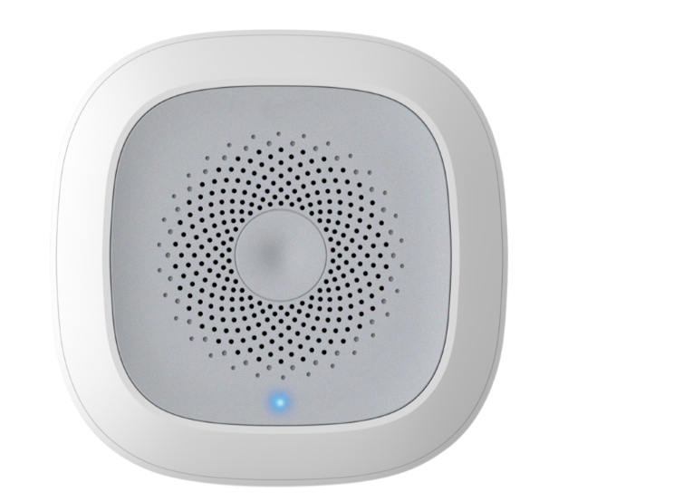
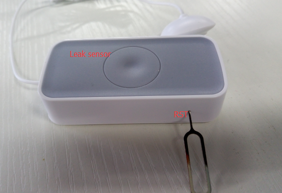

# Zigbee Sensor Temperature and Humidity



This product is a smart temperature and humidity detector,adopts extra low power consumption ZIGBEE wireless network technology, using MCU to the temperature and humidity intelligent processing, with functions of dust-proof, insect-sproof, etc. Ensuring the stability of the product from the design. With high precision temperature and humidity sensor built-in, it can perceive and report real-time temperature and humidity to APP. The product is suitable for environmental monitoring in residential, factory building, computer room, shopping mall, hotel, office building, teaching building, bank, library, as well as the warehouse and many other places.

## Features
* Operating voltage：DC3V (1 CR2450 button battery)
* Standby current：≤10uA
* Networking way：ZigBee ad hoc network
* Wireless networking distance：≤100m (open area)
* Operating temperature：-15℃～ +60℃；
* Ambient humidity：Maximum 95%RH
* Outline dimension：60x60x20.8mm

## Tutorial
we will show how to interface Deepcam ZigBee Temperature and Humidity sensor using the Linker ZigBee gateway, and serves as a basic framework for home automation sensors application.


### Prerequisites
* [pcDuino3B](http://store.cutedigi.com/pcduino3b-a20-single-board-computer-supports-arduino-programming-with-gbps-mac/) or [pcDuino8 Uno](http://store.cutedigi.com/pcduino8-uno-8-core-single-board-computer-arduino-headers-ubuntu-android/) x 1  
* [ZigBee Gateway module](http://store.cutedigi.com/linker-zigbee-module-for-deepcam-zigbee-sensors/) x 1 
* [Linker Base shield](http://store.cutedigi.com/base-shield-of-linker-kit-for-pcduino-arduino/) x 1
* [Zigbee Temperature and Humidity](http://store.cutedigi.com/water-detector/) x 1


### Steps

#### 1. Hardware connection
According to the following diagram to connect pcDuino3B, ZigBee gateway and other equipment.

 

#### 2. Download the ZigBee gateway demo code
Turn on pcDuino3B, open a terminal and download the zigBee gateway code from the [github](https://github.com/delongqilinksprite/zigbee_hum_tem.git). We also need to modify the 

* Download source files  
`https://github.com/delongqilinksprite/zigbee_hum_tem.git`


**Note**: You have to install [pyserial](https://pypi.python.org/pypi/pyserial) in the system.

#### 4. Add the Temperature and Humidity sensor  

* Run the zigbee.py program get temperature

Press and hold the **RST pin** hole of the Temperature and Humidity sensor until the green LED blink fast.  Now we can start to add device and run the code:

 

change the code line 226

```
python zigbee_tmp.py   
```  

* Run the zigbee.py program get temperature

change the code line 227

```
python zigbee_tmp.py   
```  

#### 5. How to add more ZigBee devices
Follow the steps above, we have been able to add a device, and we continue to add other devices. but we shuld use another code program and more information is [here](http://learn.linksprite.com/linkspriteio/use-deepcam-zigbee-sensors-with-linkspriteio/):

More sensors can be found at [here](http://store.cutedigi.com/sensor/).

